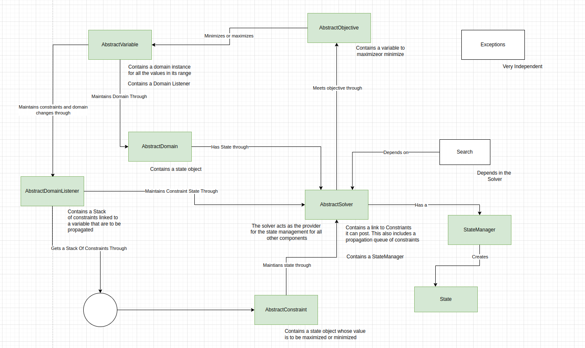
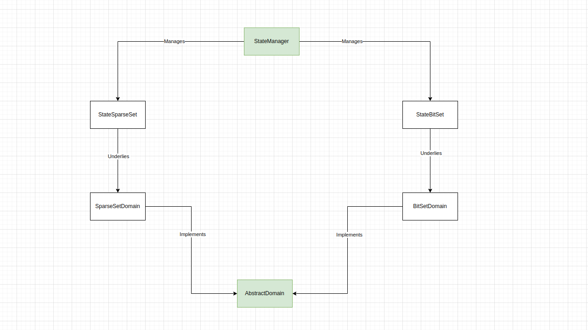
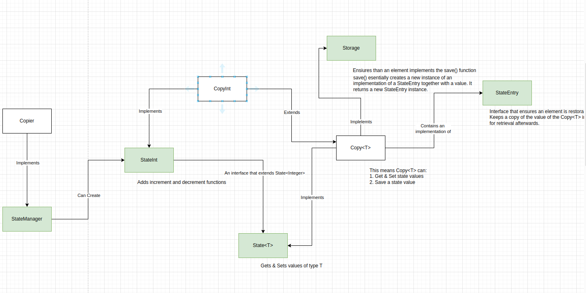
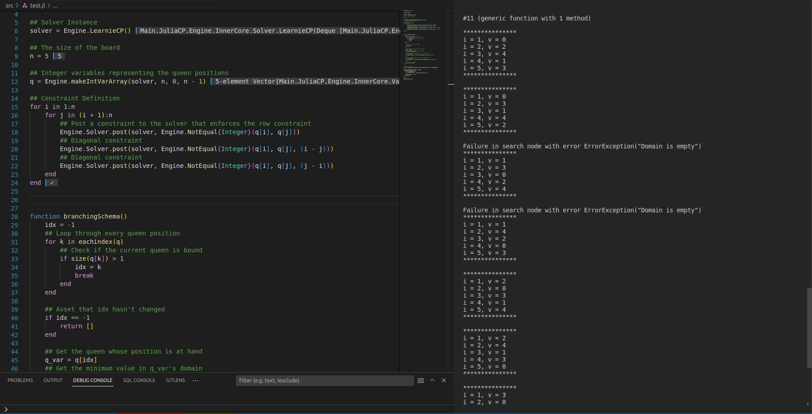
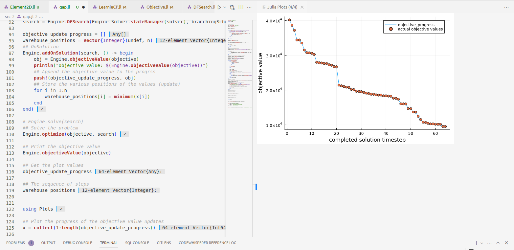
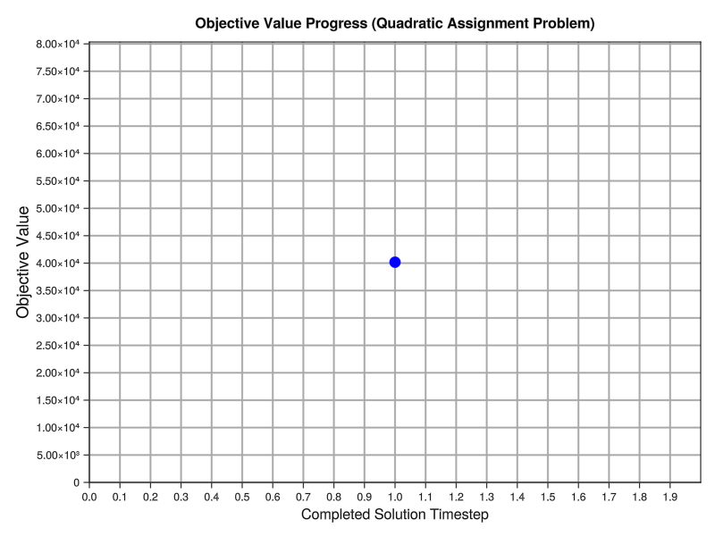
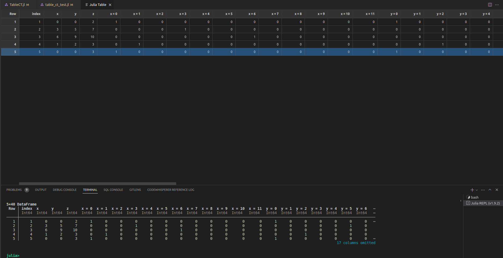

# JuliaCP

A constraint solver written completely in Julia. It is heavily inspired by [MiniCP](http://minicp.org/). The intent of this project is for pedagogical purposes. However, as development has continued, it seems like in time, it shall be released for use in development & production systems. 

--- 
### High Level Architectural View

This is a very very high level view of the components that make up the `Engine`. The problems the solver aims to provide a means to solve are `Discrete` and `Deterministic`. So far, there's only support for `Integer` variables - though not or long - rich variables will be introduced in time.

This work will be accompanies with an online book describing everything in it. 

The current implementation includes:

#### The Core
- [x] Domains
  - [x] AbstractDOmain functions
  - [x] Domain Listener implementation
  - [x] StateBitSet
  - [x] StateSparseSet
  - [x] SparseSetDomain

Here's an overview of the domain representaion:

- [x] Variables
  - [x] AbstractVariable functions
  - [x] IntVar implementation
  - [x] IntVarArray implementation
  - [x] Variable views:
    - [x] IntVarMultView
    - [x] IntVarOffsetView
- [x] Constraint shell definition
  - [x] AbstractConstraint functions
  - [x] ConstraintClosure
- [x] A set of shared interfaces
  - [x] AbstractConstraint
  - [x] AbstractDomain{T}
  - [x] AbstractDomainListener
  - [x] AbstractVariable{T}
  - [x] AbstractSolver
  - [x] AbstractObjective
- [x] Objectives
  - [x] Minimize
- [x] Solver
  - [x] LearnieCP __the core solver__
- [x] InnerCore - module that export the core functions & objects

#### Exceptions
- [x] AbstractSolverException
  - [x] InconsistencyException
  - [x] NotImplementedException
  - [x] EmptyBackUpException

- Exceptions are still experimental. The aim is to put them in distinct categories & sub-categories that will be handled in precise ways by the solver while also providing exact messages, where necessary, to the user.

#### Search
- [x] DFSearch
- [ ] SearchStatistics

#### Constraints
- [x] ConstNotEqual
- [x] ConstEqual
- [x] NotEqual
- [x] Equal
- [x] Global Constraints
  - [x] Sum
  - [x] Element2D
  - [x] Element1D
  - [x] Element1DVar
  - [ ] Table Constraint
    - [ ] Almost done - appending extensive testing.

#### Branching Scheme
- [x] SelectMin
- [x] FirstFail
- [x] And

#### State
- [x] BackUp representation
- [x] StateManagers
  - [x] AbstractStateManager
    - [x] Copier
    - [x] Trailer
- [x] AbstractState
  - [x] Copy
  - [x] Trail
- [x] StateEntry (used as entries into the backup store)
- [x] StateStack (for constraints in the domain listener)
- [x] StateInt

A sample representation of the _copier state manager_.

#### A Book on JuliaCP
- [ ] The Book Repo is [here](https://github.com/Ochibobo/LearnieCPBook)

#### Examples
- [x] backtracking
  - [x] NQueens

#### Other examples using learnie CP
- [x] SEND + MORE = MONEY
  - [x] Oughts to change based on the changes to the _sum_ constraint interface
- [x] Sudoku
- [x] Sum Test (testing the sum constraint)
- [x] NQueens
- [x] Quadratic Assignment Problem

 

Here's a small implementation of the _NQueens_ problem implementation in __LearnieCP__.

Some of these examples are accompanied by plots, especially the ones that have an objective value to be minimized. All these plots will be included in the book. A sample plot can be seen here:

#### Objective value progress for the above problem:

#### A sample table display of a table present in the TableCT constraint:

---

### RoadMap
- [ ] Constraints 
  - [ ] Global Constraints
    - [ ] AllDifferent Constraint
    - [ ] Circuit Constraint
    - [ ] Scheduling Problem Constraints
  - [ ] More localized constraints
- [ ] Branching Schema
  - [ ] Using _ML_
- [ ] SearchStatistics
- [ ] Search Heuristics
  - [ ] Simulated Annaeling
  - [ ] Random Search
  - [ ] Tabu Search
- [ ] Refined Interface
- [ ] More examples
  - [ ] TSP
  - [ ] VRP
- [ ] A Book on this approach
- [ ] Comparison with JuMP solvers.
- [ ] Continuous Variables
- [ ] Simplex or methods alike
- [ ] A smoother interface - probably link with `JuMP`
- [ ] Return the objective value of an optimization problem using `objectiveValue` function

---
> Contributions are welcome.